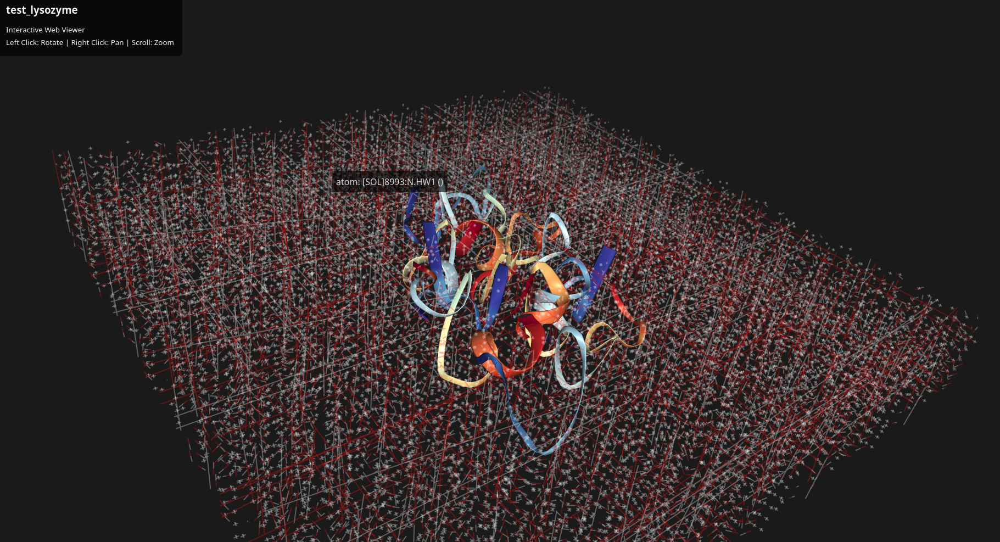

# Protein Folding Workspace

This project contains the setup and maintenance scripts for a high-performance, CUDA-accelerated protein folding environment using GROMACS and NCBI tools.

## Prerequisites
- UNIX distro (tested on Ubuntu 25.10)
- NVIDIA GPU (RTX/CUDA capable)
- NVIDIA Drivers (580+)

## Notice
I use wildcards (*) in the README because that is the most realistic use case when running repeated experiments with numbered scripts. These scripts use official sources and forego external package-managers, but it is always good practise to check scripts for safety before running.

## Quick Start

### Make scripts executable
```bash
chmod +x *.sh
```

### 1. Install Dependencies
Installs `nvidia-cuda-toolkit`, `ncbi-entrez-direct`, `gnuplot`, and build tools.
```bash
./01*
```

### 2. Install GROMACS (Source Compile)
Clones the official repository, configures for CUDA, and installs locally to `./install`.
```bash
./02*
```

## 3. Maintenance (Optional)
Run the maintenance script to verify your driver, CUDA, and GROMACS versions are correctly detected.
```bash
./03*
```

### 4. Test the Pipeline
Run the automated test script to fold Lysozyme (1AKI) and verify CUDA acceleration.
```bash
./04
```

### 5. Visualize Results
Generate a graph of the potential energy minimization and launch the 3D web viewer.
```bash
./05*
```
https://xaoscience.github.io/folding/test_lysozyme.html


### 6 + 7. Variant Discovery Pipeline
Generate and screen novel protein variants (fragments, mutants, or clones).

**Step 1: Generate Variants**
Creates a batch of PDB files. Groups by protein name (e.g., `experiments/1AKI/`).
- Default: Appends to the latest experiment folder for that protein/mode.
- `--new`: Forces a new timestamped experiment folder.
```bash
./06*
#or
./06* --new
```

**Step 2: Screen Variants**
Runs the GROMACS pipeline on the generated variants and ranks them by potential energy.
- Auto-detects the latest experiment if no argument is provided.
```bash
./07* [experiment_dir]
```
